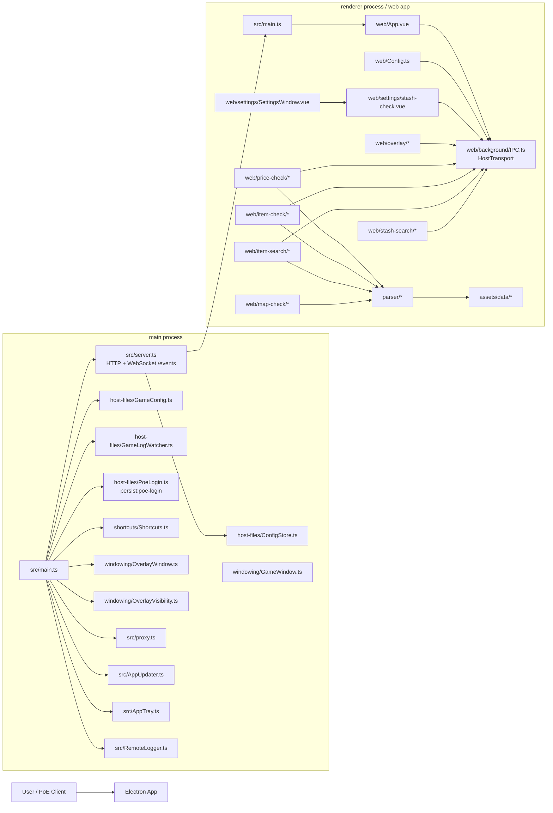
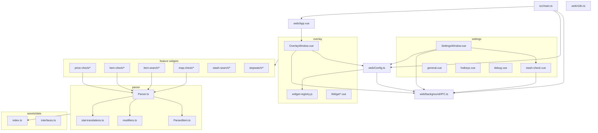
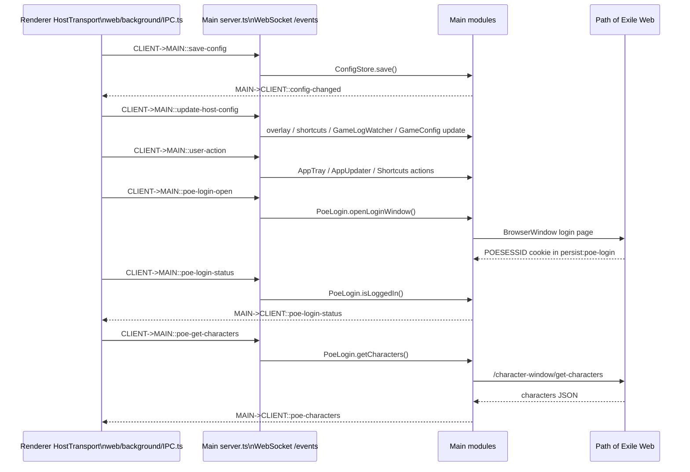
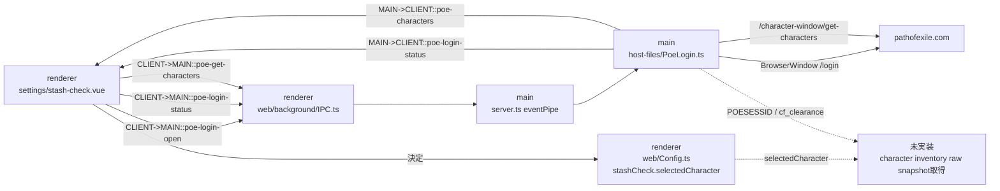
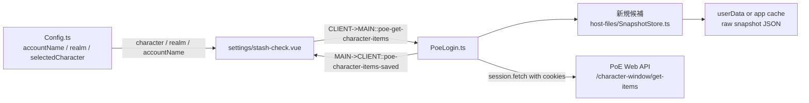

# Awakened PoE Trade JP - current app dependency diagram

作成対象: `main-src.zip` と `app-renderer.zip` の `src` 配下。
`package.json` は今回の zip には含まれていないため、npm パッケージ依存は import から見える範囲の推定です。

## 1. 全体構成

## 2. main process の依存関係

```mermaid
flowchart TD
  main_ts[src/main.ts]
  server[src/server.ts]
  RemoteLogger[src/RemoteLogger.ts]
  AppTray[src/AppTray.ts]
  AppUpdater[src/AppUpdater.ts]
  HttpProxy[src/proxy.ts]

  subgraph HostFiles[host-files]
    ConfigStore[ConfigStore.ts]
    GameConfig[GameConfig.ts]
    GameLogWatcher[GameLogWatcher.ts]
    PoeLogin[PoeLogin.ts]
    FileUploads[file-uploads.ts]
  end

  subgraph Windowing[windowing]
    GameWindow[GameWindow.ts]
    OverlayWindow[OverlayWindow.ts]
    OverlayVisibility[OverlayVisibility.ts]
    WidgetAreaTracker[WidgetAreaTracker.ts]
  end

  subgraph Shortcuts[shortcuts]
    ShortcutsTs[Shortcuts.ts]
    HostClipboard[HostClipboard.ts]
    TextBox[text-box.ts]
  end

  subgraph Vision[vision]
    HeistGemFinder[HeistGemFinder.ts]
    VisionLinkMain[link-main.ts]
    VisionWorker[link-worker.ts]
  end

  main_ts --> server
  main_ts --> RemoteLogger
  main_ts --> AppTray
  main_ts --> AppUpdater
  main_ts --> HttpProxy
  main_ts --> GameConfig
  main_ts --> GameLogWatcher
  main_ts --> PoeLogin
  main_ts --> GameWindow
  main_ts --> OverlayWindow
  main_ts --> OverlayVisibility
  main_ts --> ShortcutsTs

  server --> ConfigStore
  server --> FileUploads
  GameLogWatcher --> RemoteLogger
  GameConfig --> RemoteLogger
  OverlayWindow --> GameWindow
  OverlayVisibility --> OverlayWindow
  OverlayVisibility --> GameConfig
  ShortcutsTs --> HostClipboard
  ShortcutsTs --> GameWindow
  ShortcutsTs --> OverlayWindow
  ShortcutsTs --> GameConfig
  ShortcutsTs --> HeistGemFinder
```

## 3. renderer process の依存関係

## 4. IPC / WebSocket イベント関係

## 5. 現在の stash/snapshot 周り

## 6. 外部依存の見える範囲

### main 側

- electron
- ws
- http / fs / path / events / net / crypto / node:os
- uiohook-napi
- electron-overlay-window
- electron-updater
- comlink / worker_threads
- ini
- @wokwi/bmp-ts

### renderer 側

- vue
- vue-i18n
- @vueuse/core
- sockette
- luxon
- tippy.js
- neverthrow
- fast-deep-equal
- fastest-levenshtein
- object-hash
- dot-prop
- vuedraggable
- vue3-apexcharts

## 7. 次に snapshot 実装で追加される想定依存

