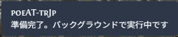
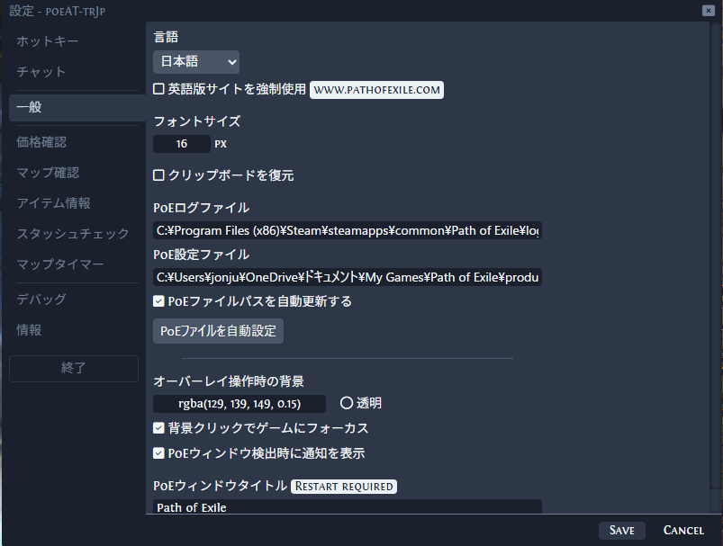
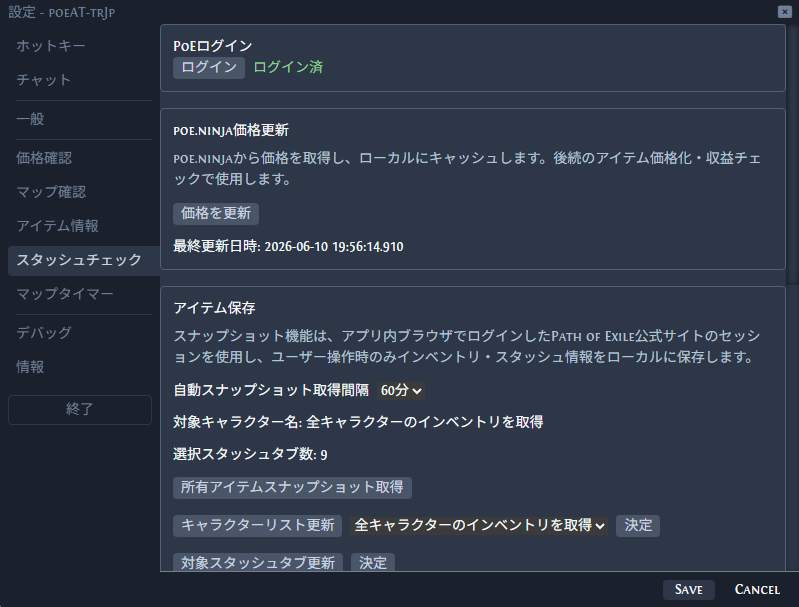
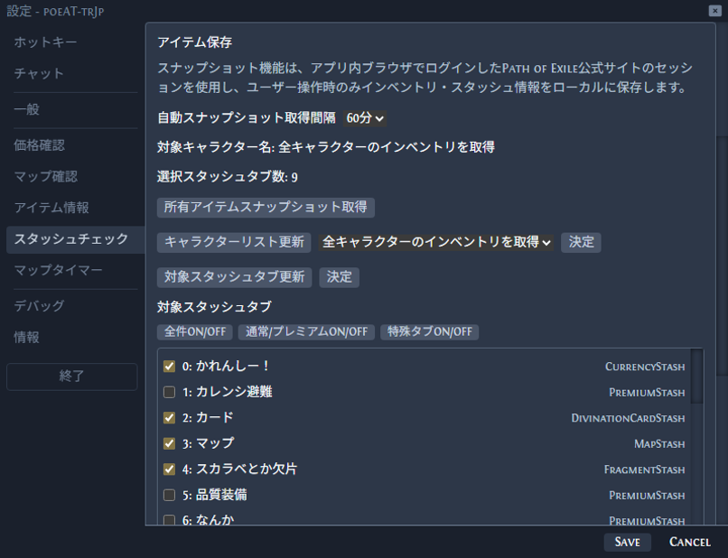
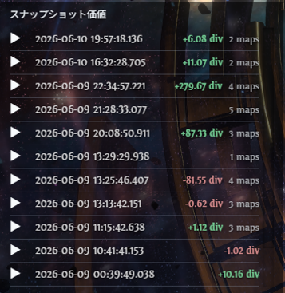
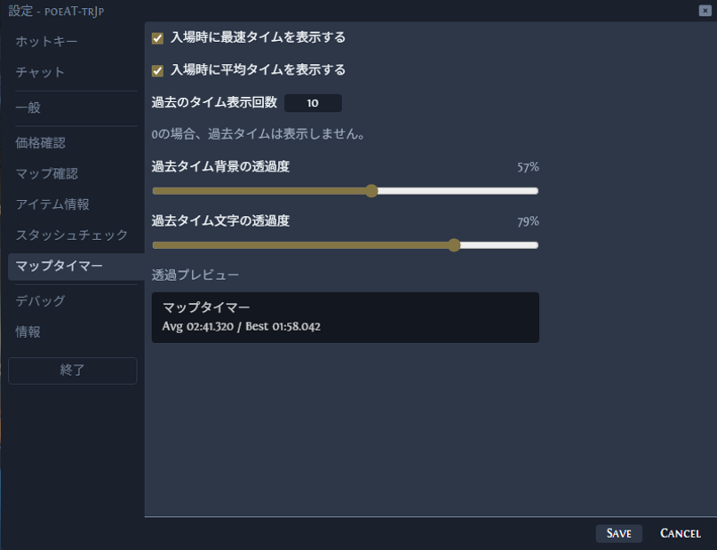
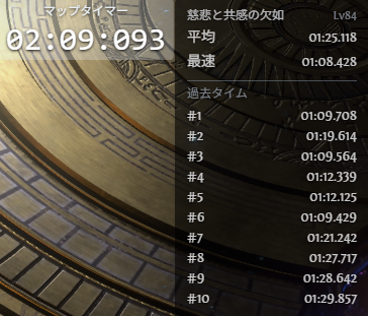
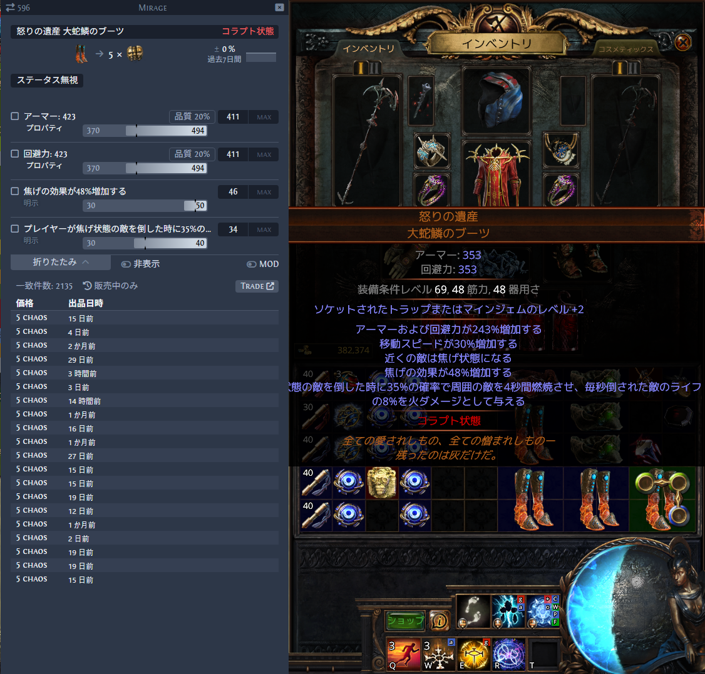

# Quick Start

- [English](#quick-start)
- [日本語](#japanese)

# Quick Start

This page explains the basic flow after installing poeAT-trJp.

poeAT-trJp can be used as an overlay while Path of Exile is active.

## 1. Start Path of Exile and poeAT-trJp

Start Path of Exile and poeAT-trJp.

When Path of Exile becomes the active window, the overlay is displayed.

## 2. Open the widget menu

Press `Shift + Space` to activate poeAT-trJp.

Select the widget or feature you want to use from the widget menu.

## 3. Open settings

Open the settings window when you need to configure the application.

In the General settings, configure the Path of Exile log file.

In most cases, the log file can be configured automatically by pressing the auto-detect button.

## 4. Configure PoE login and stash check

If you want to use the snapshot features, configure the Stash Check / PoE Login settings.

Press the login button to open the internal browser.

The Path of Exile official login page will be displayed. Log in there.

When login is detected, the login window closes automatically after a short delay.

poeAT-trJp uses poe.ninja price data.

When a snapshot is taken, price data is automatically updated if the current data is old.

Manual update is only needed when you want to control the update timing yourself.

## 5. Configure snapshot targets

Set the automatic snapshot interval.

Available options:

- OFF
- 15 minutes
- 30 minutes
- 60 minutes

Use the character list update button to select snapshot target characters.

You can select one specific character or all characters.

Use the target stash tab update button to fetch your stash tab list.

After the list is loaded, select the stash tabs you want to include.

## 6. Check snapshot results

The snapshot list shows:

- Snapshot time
- Difference from the previous snapshot
- Number of map entries since the previous snapshot

Currently, value difference support is limited mainly to currency exchange items.

Right-click a snapshot to show the delete button.

Hold the delete button to delete the snapshot.

Press the arrow button to open snapshot details. Press it again to close the details.

## 7. Configure Map Run Timer

The Map Run Timer settings can configure:

- Fastest time display
- Average time display
- Number of past times to show
- Widget opacity

## 8. Manage recorded map times

Right-click a recorded time to show the delete button.

Hold the delete button to delete the recorded time.

## 9. Map timer usage sample

Use this widget to track map run times while playing.

## 10. Price Check

Price Check is inherited from the original Awakened PoE Trade behavior.

Move your cursor over the item you want to check and press `Ctrl + D`.

You can enable or disable modifiers as needed before searching.

## If Something Does Not Work

If the application does not start or the overlay does not appear, check FAQ.

---

# Japanese

## クイックスタート

このページでは、poeAT-trJp をインストールした後の基本的な流れを説明します。

poeAT-trJp は Path of Exile の画面上で使用するオーバーレイツールです。

## 1. Path of Exile と poeAT-trJp を起動する

Path of Exile と poeAT-trJp を起動します。

起動した状態で Path of Exile の画面がアクティブになると、オーバーレイが表示されます。

## 2. ウィジェットメニューを開く

`Shift + Space` を押すと poeAT-trJp がアクティブになります。

表示されたウィジェットメニューから、利用したい項目を選択します。

## 3. 設定画面を開く

必要に応じて設定画面を開きます。

「一般」から Path of Exile のログファイルを設定してください。

「PoEファイルを自動設定」を押すことで、ほとんどの場合は自動で設定されます。

## 4. スタッシュチェックとPoEログインを設定する

スナップショット機能を利用したい場合は、スタッシュチェックとPoEログインを設定してください。

PoEログインのログインボタンを押すと、内部ブラウザで Path of Exile 公式サイトのログイン画面が表示されます。

公式サイトにログインしてください。

ログインが検知されると、約2秒後にウィンドウが自動で閉じます。

poeAT-trJp は poe.ninja から価格情報を取得します。

スナップショット取得時に価格データが古い場合は、自動で最新データに更新されます。

更新タイミングを変更したい場合のみ、手動更新を実行してください。

## 5. スナップショット対象を設定する

自動スナップショット取得間隔を設定します。

選択肢:

- OFF
- 15分
- 30分
- 60分

「キャラクターリスト更新」を押すことで、スナップショット対象キャラクターを選択できます。

指定した1キャラクター、または全てのキャラクターを選択できます。

選択後、決定を押してください。

「対象スタッシュタブ更新」を押すことで、あなたのスタッシュタブ一覧を取得します。

一覧取得後、対象にしたいスタッシュタブにチェックを入れてください。

選択後、決定を押してください。

## 6. スナップショット結果を確認する

スナップショット一覧では以下を確認できます。

- 取得した日時
- 前回取得時との差額
- 前回取得時からのマップ入場回数

差額に対応しているアイテムは、現在カレンシー交換品が中心です。

スナップショットを右クリックすると削除ボタンが表示されます。

削除ボタンを長押しすると、対象のスナップショットを削除できます。

矢印を押すと、取得したスナップショットの詳細を確認できます。

もう一度押すことで詳細を閉じます。

## 7. マップタイマーを設定する

マップタイマーでは以下を設定できます。

- 最速タイムの表示
- 平均タイムの表示
- 過去タイムの表示数
- ウィジェットの透過度

## 8. 記録されたマップタイムを管理する

対象のタイムを右クリックすると削除ボタンが表示されます。

削除ボタンを長押しすると、対象のタイムを削除できます。

## 9. マップタイマーの使用サンプル

マップ周回中のタイム計測に利用できます。

## 10. 価格チェックを使う

価格チェックは Awakened PoE Trade 本家と同様の基本機能です。

価格を調べたいアイテムにカーソルを合わせ、`Ctrl + D` を押すことで価格を確認できます。

必要に応じて MOD のオン・オフが可能です。

## うまく動かない場合

アプリが起動しない、オーバーレイが表示されないなどの場合は FAQ を確認してください。
